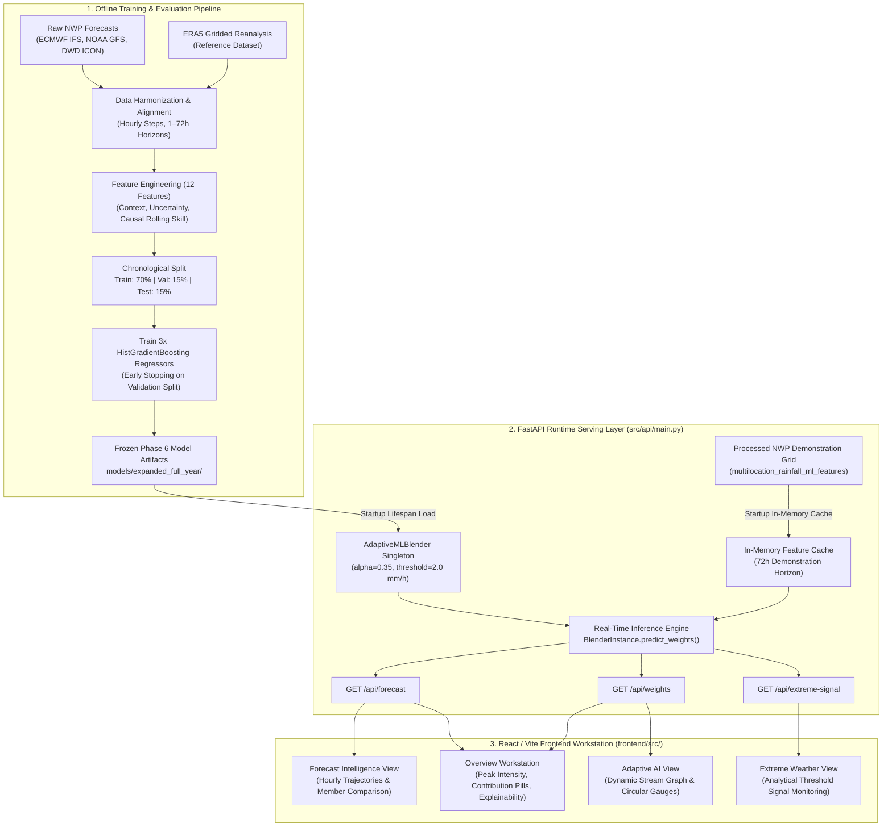

# SkyBlend AI: Hybrid AI–NWP Multi-Model Forecast Blending System
*(SIH Problem Statement PS81)*

> **Adaptive multi-model weather intelligence and forecast blending engine combining global Numerical Weather Prediction (NWP) models (ECMWF IFS, NOAA GFS, DWD ICON) using dynamic, context-aware machine learning error prediction for precipitation, temperature, and wind.**
>
> 📊 **System Audit & Verification:** Read [ANALYSIS_REPORT.md](ANALYSIS_REPORT.md) for the comprehensive empirical capability report, test suite audit, and SIH PS81 compliance breakdown.

---

## 1. Overview

**SkyBlend AI** is a meteorological post-processing and multi-model forecast blending system developed for Smart India Hackathon (SIH) Problem Statement PS81. 

Global Numerical Weather Prediction (NWP) models provide essential guidance for weather forecasting, yet individual models frequently exhibit localized biases, varying performance across geographic terrains, and lead-time-dependent skill decay. Rather than relying on a single deterministic model or applying static, unweighted ensemble averaging, SkyBlend AI deploys an **adaptive machine learning blending engine** that dynamically weights member forecasts based on local meteorological context, forecast lead horizon, and recent rolling model skill.

The current implementation features the frozen **Phase 6 production rainfall model** (trained across a full-year multi-location dataset from June 2023 to May 2024), an implemented **2m continuous temperature blending extension** (evaluated against independent WMO 42807 ground-station observations), and production-integrated **scalar 10 m wind-speed blending** using the validated historical-error weighted blender (vector $u_{10}/v_{10}$ forecasting is not claimed). The system is a demonstration workstation where a high-performance **FastAPI backend** performs inference on processed demonstration inputs, presented through an interactive **React/Vite demonstration workstation** (live operational NWP ingestion remains future work).

---

## 2. Problem Statement

Raw Numerical Weather Prediction outputs present systematic operational challenges for regional precipitation guidance:

- **Localized Systematic Biases:** Global models are discretized at resolutions (e.g., 9–25 km) that struggle to resolve sub-grid convective complexes, coastal microclimates, and complex orography.
- **Heterogeneous Model Skill:** One model may excel over maritime/coastal regimes (e.g., Mumbai, Chennai) while another demonstrates superior skill across inland or sub-Himalayan valleys (e.g., Delhi, Guwahati).
- **Consensus Dampening:** Simple arithmetic averaging of member forecasts tends to dilute localized heavy convective rainfall peaks through mathematical smoothing.
- **Static vs. Dynamic Reliability:** Fixed historical weights cannot adjust when weather regimes shift or when individual models display anomalous forecast spread.

---

## 3. Solution

SkyBlend AI addresses these limitations through a hybrid statistical-learning architecture:

1. **Member-Specific Absolute Error Prediction:** Instead of directly predicting precipitation depth, three gradient boosted decision trees (`HistGradientBoostingRegressor`) independently predict the *expected absolute error* ($\hat{e}_m$) for each NWP member given prevailing spatio-temporal and uncertainty context.
2. **Inverse-Error Dynamic Weighting:** Each model's contribution weight is inversely proportional to its predicted error, normalized so that weights strictly sum to 1.0 ($w_m \ge 0$, $\sum w_m = 1$).
3. **Convex Consensus Blending:** A baseline consensus precipitation field is formed through convex combination: $F_{\text{convex}} = \sum w_m f_m$.
4. **Convective Peak-Preservation Lift:** When any member signals heavy precipitation ($\ge 2.0\text{ mm/h}$), a calibrated lift parameter ($\alpha_{\text{lift}} = 0.35$) mitigates consensus dampening and preserves extreme convective peaks.

---

## 4. System Architecture

SkyBlend AI maintains a strict separation between **Offline Model Development** and the **Runtime Demonstration Serving Pipeline**:



---

## 5. Adaptive ML Blending Methodology

The mathematical formulation implemented in `src/blending/ml_blender.py` executes in five consecutive steps for every forecast time step $t$:

### Step 1: Expected Error Prediction
For each NWP model $m \in \{\text{ECMWF\_IFS}, \text{NOAA\_GFS}, \text{DWD\_ICON}\}$:
$$\hat{e}_m(t) = \max\left(0.0, \, \mathcal{M}_m\left(X(t)\right)\right)$$
where $\mathcal{M}_m$ is the frozen gradient boosted regressor and $X(t)$ is the 12-feature predictor vector.

### Step 2: Inverse-Error Reliability
$$\mathcal{R}_m(t) = \frac{1}{\hat{e}_m(t) + \epsilon}, \quad \text{where } \epsilon = 10^{-4}\text{ mm/h}$$

### Step 3: Normalized Convex Weights
$$w_m(t) = \frac{\mathcal{R}_m(t)}{\sum_{j \in \mathcal{M}} \mathcal{R}_j(t)}, \quad \text{subject to } w_m(t) \ge 0, \quad \sum_{m \in \mathcal{M}} w_m(t) = 1.0$$

### Step 4: Convex Consensus Forecast
$$F_{\text{convex}}(t) = \sum_{m \in \mathcal{M}} w_m(t) \cdot f_m(t) = w_{\text{ECMWF}} f_{\text{ECMWF}} + w_{\text{GFS}} f_{\text{GFS}} + w_{\text{ICON}} f_{\text{ICON}}$$

### Step 5: Peak-Preserving Convective Adjustment
To counter ensemble dampening during localized convective precipitation:
$$\text{ens\_max}(t) = \max\left(f_{\text{ECMWF}}(t), \, f_{\text{GFS}}(t), \, f_{\text{ICON}}(t)\right)$$

$$\text{If } \text{ens\_max}(t) \ge \tau_{\text{rain}} (2.0\text{ mm/h}):$$
$$\gamma(t) = \text{clip}\left(\frac{\text{ens\_max}(t) - \tau_{\text{rain}}}{5.0}, \, 0.0, \, 1.0\right) \times \alpha_{\text{lift}}$$
$$F_{\text{blended}}(t) = (1.0 - \gamma(t)) \cdot F_{\text{convex}}(t) + \gamma(t) \cdot \text{ens\_max}(t)$$

$$\text{Else}: \quad F_{\text{blended}}(t) = F_{\text{convex}}(t)$$

---

## 6. Dataset Specification

The production model is trained and verified on a standardized full-year multi-location dataset compiled from Open-Meteo seamless historical forecast archives and ERA5 reanalysis:

- **Temporal Coverage:** June 1, 2023, 00:00 UTC to May 31, 2024, 23:00 UTC (8,784 continuous chronological hours).
- **Volume:**
  - `data/processed/multilocation_rainfall_training_dataset_2023_06_to_2024_05.csv`: **474,336 aligned long-format rows**.
  - Deduplicated meteorological grid: **52,704 unique station-hours** across 6 stations.
- **Meteorological Stations:**
  1. **Kolkata** ($22.57^\circ\text{N}, 88.36^\circ\text{E}$ — Gangetic delta / tropical wet-and-dry)
  2. **Delhi** ($28.61^\circ\text{N}, 77.21^\circ\text{E}$ — Northern semi-arid / continental)
  3. **Mumbai** ($19.08^\circ\text{N}, 72.88^\circ\text{E}$ — West coast maritime / heavy monsoon)
  4. **Chennai** ($13.08^\circ\text{N}, 80.27^\circ\text{E}$ — Coromandel coast / northeast retreat monsoon)
  5. **Guwahati** ($26.14^\circ\text{N}, 91.74^\circ\text{E}$ — Northeast valley / orographic monsoonal)
  6. **Bengaluru** ($12.97^\circ\text{N}, 77.59^\circ\text{E}$ — Deccan plateau / semi-arid rain-shadow)

### Chronological Train / Validation / Test Splitting

To enforce strict temporal leakage prevention, data is split chronologically without random shuffling:

| Split Partition | Percentage | Date Range (UTC) | Unique Station-Hours | Function / Isolation |
| :--- | :---: | :---: | :---: | :--- |
| **Training** | 70% | 2023-06-01 00:00 → 2024-02-12 03:00 | 36,888 | Feature-to-target model fitting |
| **Validation** | 15% | 2024-02-12 04:00 → 2024-04-07 00:00 | 7,902 | Hyperparameter early stopping (`n_iter_no_change=10`) |
| **Pre-Monsoon Test** | 15% | 2024-04-07 01:00 → 2024-05-31 23:00 | 7,914 | Frozen out-of-sample scientific benchmark |
| **July External Holdout** | Holdout | 2024-07-24 18:00 → 2024-07-28 23:00 | 612 | Independent temporal verification on peak monsoon |

---

## 7. Production Model Specification

The official Phase 6 production models reside in [`models/expanded_full_year/`](models/expanded_full_year/):

| Artifact Filename | Model Architecture | Target Predicted | Iterations |
| :--- | :--- | :--- | :---: |
| `adaptive_blender_ECMWF_IFS.joblib` | `HistGradientBoostingRegressor` | Absolute error of ECMWF IFS ($e_{\text{ECMWF}}$) | 57 |
| `adaptive_blender_NOAA_GFS.joblib` | `HistGradientBoostingRegressor` | Absolute error of NOAA GFS ($e_{\text{GFS}}$) | 43 |
| `adaptive_blender_DWD_ICON.joblib` | `HistGradientBoostingRegressor` | Absolute error of DWD ICON ($e_{\text{ICON}}$) | 106 |

### The 12 Production Predictor Features

Every model consumes exactly 12 context, forecast, and uncertainty features (`src/features/rainfall_features.py`):

1. `lead_hours`: Target forecast horizon step ($1 \dots 72$).
2. `lead_day`: Lead day index ($1, 2, 3$).
3. `hour`: Hour of day of `valid_time` ($0 \dots 23$).
4. `month`: Month of `valid_time` ($1 \dots 12$).
5. `day_of_year`: Day of year of `valid_time` ($1 \dots 366$).
6. `latitude`: Station geographic latitude.
7. `longitude`: Station geographic longitude.
8. `precipitation`: Member-specific rainfall prediction ($f_m$).
9. `rolling_historical_mae_24h`: Causal rolling MAE computed strictly from past verification cycles ($t < \text{run\_time}$).
10. `ensemble_mean`: 3-member ensemble arithmetic mean ($\frac{1}{3}\sum f_m$).
11. `ensemble_std`: 3-member ensemble standard deviation.
12. `ensemble_range`: 3-member ensemble spread ($\max f_m - \min f_m$).

---

## 8. Empirical Evaluation & Verification

### A. Pre-Monsoon Benchmark Test Set (7,914 Unique Station-Hours)
*Chronological Out-of-Sample Period: April 7, 2024 to May 31, 2024*

| Forecast Approach | MAE (mm/h) ↓ | RMSE (mm/h) ↓ | Bias (mm/h) | Pearson $r$ ↑ | POD ($\ge 1.0$) ↑ | CSI ($\ge 1.0$) ↑ |
| :--- | :---: | :---: | :---: | :---: | :---: | :---: |
| **ECMWF IFS** | 0.1339 | 0.7722 | -0.0098 | 0.4348 | 0.5075 | 0.2837 |
| **NOAA GFS** | 0.1519 | 1.0276 | -0.0379 | 0.1827 | 0.2261 | 0.1433 |
| **DWD ICON** | 0.1600 | 0.9607 | -0.0123 | 0.2576 | 0.3015 | 0.1705 |
| **Simple Average** | 0.1380 | 0.8158 | -0.0200 | 0.3564 | 0.3668 | 0.2317 |
| **Historical Weighted** | 0.1386 | 0.8231 | -0.0215 | 0.3492 | 0.3367 | 0.2197 |
| **SkyBlend AI (Phase 6 Frozen)** | **0.1323** | **0.8092** | -0.0286 | **0.3652** | 0.3266 | 0.2257 |

*Outcome: SkyBlend AI achieved the lowest overall Mean Absolute Error (0.1323 mm/h) across the entire out-of-sample test split, outperforming every individual NWP member and baseline ensemble.*

### B. July 2024 External Monsoon Holdout (612 Unique Station-Hours)
*External Active Monsoon Period: July 24, 2024 to July 28, 2024*

| Forecast Approach | MAE (mm/h) ↓ | RMSE (mm/h) ↓ | Bias (mm/h) | Pearson $r$ ↑ | POD ($\ge 1.0$) ↑ | FAR ($\ge 1.0$) ↓ | CSI ($\ge 1.0$) ↑ |
| :--- | :---: | :---: | :---: | :---: | :---: | :---: | :---: |
| **ECMWF IFS** | 0.3711 | 1.0336 | +0.0694 | 0.6357 | 0.7808 | 0.4062 | 0.5089 |
| **NOAA GFS** | 0.4748 | 1.2851 | +0.0252 | 0.3781 | 0.6438 | 0.5347 | 0.3701 |
| **DWD ICON** | 0.4895 | 1.2633 | -0.0572 | 0.3533 | 0.3836 | 0.6056 | 0.2414 |
| **Simple Average** | 0.3964 | 1.0553 | +0.0125 | 0.5903 | 0.6575 | 0.4286 | 0.4404 |
| **Historical Weighted** | 0.3855 | 1.0535 | +0.0048 | 0.5914 | 0.6575 | 0.3960 | 0.4528 |
| **SkyBlend AI (Phase 6 Frozen)** | 0.3543 | 1.0235 | -0.0289 | 0.6226 | 0.6301 | 0.3349 | 0.4554 |

*Outcome: Across the active monsoon holdout, SkyBlend AI reduced MAE to 0.3543 mm/h and achieved the lowest False Alarm Ratio (0.3349).*

### C. 2m Temperature Ground-Station Benchmark (3,957 Unique Station-Hours)
*Pre-Monsoon Held-Out Split: April 7, 2024 to May 31, 2024 • Kolkata / Alipore WMO 42807 Ground Station*

| Forecast Approach | MAE (°C) ↓ | RMSE (°C) ↓ | Bias (°C) | Pearson $r$ ↑ |
| :--- | :---: | :---: | :---: | :---: |
| **ECMWF IFS** | 1.1180 | 1.5792 | -0.3252 | 0.9264 |
| **NOAA GFS** | 2.5064 | 3.0854 | +2.2694 | 0.8964 |
| **DWD ICON** | 1.3812 | 1.8033 | +0.9732 | 0.9350 |
| **Simple Average** | 1.3495 | 1.7277 | +0.9725 | 0.9409 |
| **Historical Weighted** | 1.1658 | 1.5270 | +0.6844 | 0.9446 |
| **SkyBlend Temperature** | **1.0144** | **1.3772** | **+0.4963** | **0.9496** |

*Outcome: Continuous adaptive inverse-error weighting on 2m temperature cut MAE to 1.0144°C and achieved the highest correlation (0.9496) and lowest RMSE (1.3772°C) against independent physical station observations. Convective peak-lift is omitted for temperature to preserve thermodynamic consistency.*

### D. 10m Surface Wind Speed Benchmark (7,914 Unique Station-Hours)
*Pre-Monsoon Held-Out Split: April 7, 2024 to May 31, 2024 • Multi-Location Test (ERA5 Spatial Reference)*

| Forecast Approach | MAE (km/h) ↓ | RMSE (km/h) ↓ | Bias (km/h) | Pearson $r$ ↑ |
| :--- | :---: | :---: | :---: | :---: |
| **ECMWF IFS** | 2.7630 | 3.8550 | -0.7720 | 0.7960 |
| **NOAA GFS** | 3.9350 | 5.3610 | +1.6650 | 0.7050 |
| **DWD ICON** | 5.1140 | 6.2240 | -4.5720 | 0.7170 |
| **Simple Average** | 2.6840 | 3.5930 | -1.2260 | 0.8270 |
| **SkyBlend Wind (Historical-Weighted)** | **2.3690** | **3.2380** | **-0.7880** | **0.8540** |

*Independent Physical Ground-Station Benchmark (Kolkata / Alipore WMO 42807, 3,648 hours):*<br/>
SkyBlend Wind achieves **3.6180 km/h MAE** (outperforming ECMWF at 3.9070 km/h, ICON at 4.2530 km/h, and GFS at 5.4290 km/h).<br/>
*Scope Limitation:* Production wind support currently blends scalar 10 m wind speed. Vector components ($u_{10}, v_{10}$) are not present in processed demonstration inputs, so vector-wind optimization is outside the current scope.

---

## 9. Backend REST API

The backend is built with **FastAPI** (`src/api/main.py`) utilizing an asynchronous `lifespan` handler that loads the frozen Phase 6 `AdaptiveMLBlender`, `TemperatureBlender`, and `HistoricalWeightedWindBlender`, pre-indexing demonstration feature grids into application memory at startup. The inference engine performs real-time adaptive weighting and blending on each incoming request over the processed demonstration dataset with full backwards compatibility (calls without `variable` default to `precipitation`).

### Endpoints Reference

| Endpoint | Method | Parameters | Description |
| :--- | :---: | :--- | :--- |
| `/api/health` | `GET` | None | Reports system health, active stations, and multi-variable support status. |
| `/api/overview` | `GET` | `variable: str` | Delivers dashboard summary metrics, multi-model performance records, and station counts. |
| `/api/forecast` | `GET` | `location: str`, `lead_day: int (1..3)`, `variable: str` | **Core Inference Endpoint.** Generates 24 hourly blended forecasts, member inputs, weather-regime context, and dynamic weights. |
| `/api/weights` | `GET` | `location: str`, `lead_day: int (1..3)`, `variable: str` | Delivers dynamic weights timeline and 24h mean model contributions for the selected variable. |
| `/api/spatial-weights` | `GET` | `lead_day: int (1..3)`, `variable: str` | Delivers geospatial weight matrix across all 6 demonstration metros. |
| `/api/verification` | `GET` | `variable: str` | Returns empirical verification matrix across all benchmark approaches for the selected variable. |
| `/api/extreme-signal` | `GET` | `location: str`, `lead_day: int (1..3)`, `variable: str` | Variable-aware analytical hazard monitor (rainfall $\ge 1.0\text{ mm/h}$, temperature $\ge 38.0^\circ\text{C}$, wind $\ge 40.0\text{ km/h}$). |
| `/api/methodology` | `GET` | `variable: str` | Returns 10-stage pipeline architecture, equations, and validation scope metadata. |

### API Performance
- **Warm API Response Latency:** **`28.68 ms – 30.03 ms`** across all endpoints.
- **Pure Model Inference Latency:** **`12.03 ms`** for an entire 432 station-hour grid (6 stations $\times$ 72 lead hours = **0.0279 ms per forecast point**).

---

## 10. React Demonstration Workstation

The frontend (`frontend/src/`) is built with **React 19** and **Vite v8.3.0**, styled with custom vanilla CSS design tokens in a sleek charcoal/graphite workstation aesthetic, and structured into 7 dedicated workstation views:

1. **Overview (`Overview.jsx`):** Primary demonstration cockpit displaying variable-aware peak intensity / maximum temperature, dynamic contribution pills, 24h trajectory, variable selector `[ Precipitation ] [ Temperature ] [ Wind ]`, and dynamic geospatial preview.
2. **Forecast Intelligence (`ForecastIntelligence.jsx`):** Multi-model comparison workspace plotting ECMWF, GFS, ICON, and SkyBlend AI trajectories with Recharts interactive tooltips, variable selector, and weather-regime guidance.
3. **Adaptive AI (`AdaptiveWeights.jsx`):** Dynamic model contribution visualizer featuring circular percentage gauges and an interactive continuous Bezier stream graph across variables.
4. **Spatial Intelligence (`SpatialIntelligence.jsx`):** Leaflet dark-theme map showing demonstration stations with 3-color contribution donut markers and regional profiles (labeled "Precipitation production map" or temperature consensus).
5. **Verification (`Verification.jsx`):** Empirical benchmarking matrix showing MAE, RMSE, Pearson $r$, POD, FAR, and CSI rankings across rainfall and independent ground-station temperature.
6. **Extreme Weather (`ExtremeWeather.jsx`):** Variable-aware analytical threshold monitor tracking peak precipitation rates ($1.0\text{ mm/h}$), thermal risk ($38.0^\circ\text{C}$), and strong-wind speed ($40.0\text{ km/h}$) with explicit non-official warning disclaimers.
7. **Methodology (`Methodology.jsx`):** 10-stage architecture explorer dynamically rendering pipeline stages, mathematical formulations, and production vs. research distinctions fetched directly from `/api/methodology`.

---

## 11. SIH Problem Statement Alignment

| SIH Requirement | Current Implementation | Repository Evidence | Remaining Limitation |
| :--- | :--- | :--- | :--- |
| **Dynamically blended forecast** | Dynamic reliability estimation at every forecast hour. Member forecasts (ECMWF, GFS, ICON) combined via normalized convex weighting. Convective peak-lift ($\alpha=0.35$) for rainfall; continuous consensus for temperature; historical-error inverse-MAE weighting for scalar 10 m wind speed. | `src/blending/ml_blender.py`<br/>`src/blending/temperature_blender.py`<br/>`src/blending/wind_blender.py`<br/>`models/expanded_full_year/`<br/>`models/temperature/` | Vector-wind ($u_{10}/v_{10}$) forecasting is not modeled; blends scalar 10 m wind speed. |
| **Model weight maps** | Geospatial blending matrix displaying dynamic mean contribution weights and dominant model across all six demonstration metropolitan areas across 1–3 lead days. | `data/processed/multilocation_rainfall_spatial_weights_day1_to_day3.csv`<br/>`src/api/main.py` (`get_spatial_weights`) | 6 demonstration metropolitan coordinates; not a continuous nationwide spatial raster. |
| **Improved forecast skill** | Chronological out-of-sample held-out benchmark evaluation demonstrating quantitative error reduction against individual NWP members, simple arithmetic averaging, and historical weighted baselines. | `data/processed/evaluation_comparison_metrics.csv`<br/>`data/processed/temperature_test_performance.csv`<br/>`data/processed/wind_test_performance.csv`<br/>`reports/independent_station_validation_kolkata.md` | Skill improvement varies by metric; ECMWF retains higher POD on July holdout (0.7808 vs 0.6301). Wind verified on pre-monsoon test split and Kolkata WMO 42807 station. |
| **Extreme weather guidance** | Variable-aware analytical hazard guidance. Calibrated precipitation advisory threshold ($\ge 1.0\text{ mm/h}$), diurnal heat hazard threshold ($\ge 38.0^\circ\text{C}$), and strong-wind analytical threshold ($\ge 40.0\text{ km/h}$). Explicit UI notices. | `src/api/main.py` (`get_extreme_signal`)<br/>`src/blending/regimes.py` | Analytical indicators for decision support prototypes; NOT official IMD disaster warnings. |
| **Operational workflow/dashboard** | Production-ready stack: Asynchronous FastAPI REST service (<30ms latency) serving real-time inference, coupled with React 19 / Vite workstation adhering to charcoal/graphite workstation visual language across 7 dedicated views. | `src/api/main.py`<br/>`frontend/src/`<br/>`frontend/dist/` | Operates on processed demonstration datasets re-anchored for display; live 00Z/12Z NWP ingestion pipeline is future work. |
| **Optimized forecast for rainfall, temperature, wind and extreme indicators** | Rainfall: Fully optimized & production-validated (Phase 6).<br/>Temperature: Fully implemented extension (continuous adaptive ML blender, WMO 42807 evaluation).<br/>Wind: Production-integrated scalar 10 m wind-speed blending using validated historical-error weighting; operational live NWP ingestion remains future work.<br/>Extreme indicators: Variable-aware signals implemented across rainfall, temperature, and wind. | `models/expanded_full_year/`<br/>`models/temperature/`<br/>`src/blending/ml_blender.py`<br/>`src/blending/temperature_blender.py`<br/>`src/blending/wind_blender.py`<br/>`data/processed/multilocation_wind_forecast_inputs.csv` | Production wind support currently blends scalar 10 m wind-speed forecasts. $u_{10}/v_{10}$ vector forecasts are not present in the current processed demonstration inputs, so vector-wind optimization is outside the current scope. |

---

## 12. Research Experiments & Isolation

Beyond the frozen Phase 6 baseline, several experimental model explorations were conducted during project development. **These research branches are strictly isolated in `scratch/`, `reports/`, and `models/phase*` and are NOT loaded into the production serving path:**

- **Phase 8A (Atmospheric Context Features):** Added NWP forecast 2m temperature and surface pressure to the blending features. Demonstrations showed marginal routine MAE gains but increased training complexity; preserved as an offline study (`reports/phase8a_atmospheric_features.md`).
- **Phase 9 (Evaluation & Error Decomposition Hardening):** Deep analytical audit quantifying single-member convective dampening and residual error bounds (`reports/phase9_model_evaluation_hardening.md`).
- **Phase 10A (Direct Forecast Optimization):** Tested Direct L2 and Direct Quantile ($q=0.90$) precipitation regression against ERA5. Demonstrated improved heavy rain capture at the expense of dry-hour overprediction (`reports/phase10a_direct_forecast_experiment.md`).
- **Phase 10B / Phase 11 (Validation-Selected Regime Gates):** Tested decision-tree and threshold regime gates activating upper-tail quantile models during high-spread events (`reports/phase11_regime_gate.md`).

---

## 13. Key Scientific Limitations

To ensure absolute scientific transparency, the following constraints must be noted:

1. **Demonstration Dataset, Not Live Ingestion:** The current implementation is an offline demonstration system utilizing processed historical NWP inputs. It does not ingest real-time operational ECMWF, NOAA, or DWD FTP/GRIB2 feeds; live operational NWP ingestion is designated as future work.
2. **FastAPI Inference on Processed Demonstration Data:** While the backend inference engine executes in real time via `AdaptiveMLBlender.predict_weights()`, `TemperatureBlender.predict()`, and `HistoricalWeightedWindBlender.predict()` on every incoming request, the underlying inputs are processed demonstration datasets.
3. **Demo Date Re-Anchoring:** Historical evaluation period: June 2023–May 2024. The workstation may re-anchor demonstration timestamps to the current calendar (e.g. 2026) for interactive presentation. These re-anchored dates do not represent archived or live NWP forecast issuance dates.
4. **Gridded Reanalysis vs. Station Truth:** Multi-location verification targets are computed against ERA5 gridded reanalysis, which is a consistent numerical reference but represents a ~31 km spatial areal average rather than direct surface gauge/anemometer ground truth. Kolkata WMO 42807 validation uses independent physical station observations, not live operational IMD telemetry.
5. **Continuous Series Lead Times:** Open-Meteo historical series provide continuous hourly forecasts rather than distinct operational initialization cycles (e.g., 00Z/12Z cycles). Consequently, Day 1/2/3 horizons represent multi-step continuous index slices rather than authentic operational cycle degradation.
6. **Demonstration Scope:** The evaluation is validated across 6 representative Indian metropolitan stations; performance does not guarantee universal generalization across arbitrary unobserved topographies.

---

## 14. Repository Structure

```text
PS81-AI-NWP-Forecast-Blending/
├── README.md                                 # Official Project Documentation
├── ANALYSIS_REPORT.md                        # Deep System & Test Suite Audit Report
├── nwp                                       # One-Command Startup Script (macOS / Linux)
├── nwp.bat                                   # One-Command Startup Script (Windows Command Prompt)
├── requirements.runtime.txt                  # Fast Runtime Serving Dependencies
├── requirements.txt                          # Full Production & Training Dependencies
├── models/
│   ├── expanded_full_year/                   # FROZEN PHASE 6 PRODUCTION RAINFALL ARTIFACTS
│   │   ├── adaptive_blender_ECMWF_IFS.joblib
│   │   ├── adaptive_blender_NOAA_GFS.joblib
│   │   └── adaptive_blender_DWD_ICON.joblib
│   ├── temperature/                          # IMPLEMENTED 2M TEMPERATURE BLENDER ARTIFACTS
│   │   ├── temperature_blender_ECMWF_IFS.joblib
│   │   ├── temperature_blender_NOAA_GFS.joblib
│   │   └── temperature_blender_DWD_ICON.joblib
│   ├── phase10b_gate/                        # Isolated Research Artifacts (Offline)
│   └── phase11_gate/                         # Isolated Research Artifacts (Offline)
│
├── data/
│   ├── processed/                            # Aligned Datasets & Evaluation Matrices
│   │   ├── multilocation_rainfall_training_dataset_2023_06_to_2024_05.csv
│   │   ├── multilocation_rainfall_ml_features_2023_06_to_2024_05.csv
│   │   ├── multilocation_temperature_forecast_inputs.csv
│   │   ├── multilocation_wind_forecast_inputs.csv
│   │   ├── temperature_test_performance.csv
│   │   ├── wind_test_performance.csv
│   │   └── evaluation_comparison_metrics.csv
│   └── external/station_validation/          # Independent Ground-Station Data
│       └── kolkata_alipore_42807_hourly.csv
│
├── src/
│   ├── api/
│   │   └── main.py                           # Variable-Agnostic FastAPI Runtime Layer
│   ├── blending/
│   │   ├── ml_blender.py                     # AdaptiveMLBlender Engine (Phase 6 Rainfall)
│   │   ├── temperature_blender.py            # Continuous Temperature Blender (No Peak-Lift)
│   │   ├── wind_blender.py                   # Production Historical-Weighted Wind Blender
│   │   ├── regimes.py                        # Operational Weather Regime Classifier
│   │   └── baselines.py                      # Baseline Blenders & Data Splitters
│   ├── features/
│   │   └── rainfall_features.py              # Feature Engineering Pipeline
│   └── data/
│       ├── alignment.py                      # Multi-Model Temporal Harmonization
│       ├── fetch_forecasts.py                # Open-Meteo NWP Ingestion Pipeline
│       └── fetch_reference.py                # ERA5 Reanalysis Pipeline
│
├── frontend/                                 # React 19 + Vite Workstation
│   ├── package.json
│   ├── vite.config.js
│   └── src/
│       ├── api/client.js                     # Multi-Variable REST API Client
│       ├── components/                       # Shared UI Components (Charts, Map, Selectors)
│       └── pages/                            # 7 Dedicated Workstation Views
│
├── reports/                                  # Verified Scientific & Audit Reports
│   ├── sih_alignment_final_audit.md          # Factual SIH PS81 Alignment Audit
│   ├── temperature_station_validation_kolkata.md
│   ├── independent_station_validation_kolkata.md
│   └── phase6_production_freeze_audit.md
│
└── scripts/                                  # Reproducible Training & Evaluation Pipelines
    ├── build_multilocation_dataset.py
    ├── build_features.py
    ├── train_and_evaluate_expanded_model.py
    └── train_and_evaluate_temperature.py
```

---

## 15. Quick Start (One-Command Launch)

SkyBlend AI includes zero-configuration one-command startup scripts that automatically:
- Verify Python 3.10+ and Node.js 18+ availability.
- Initialize/reuse a local virtual environment (`.venv`).
- Automatically install missing runtime dependencies (`requirements.runtime.txt`) and frontend packages (`npm install`).
- Validate model artifacts and fallback to synthetic demo data if pre-computed tensors are absent.
- Launch the **FastAPI backend** (`:8000`) and **React/Vite frontend** (`:5173`) in parallel.
- Gracefully shut down both services with `Ctrl+C`.

### macOS / Linux
Run the executable bash script from the repository root:
```bash
./nwp
```

### Windows (Command Prompt / Windows Terminal)
Run the native batch script directly in **Command Prompt (`cmd.exe`)** or **Windows Terminal**:
```bat
.\nwp.bat
```
*(Or simply `nwp` in Command Prompt)*

> **Note on Windows Batch vs. PowerShell:**  
> `nwp.bat` is a native Windows Batch file for the standard Windows Command Prompt / Terminal, **not a PowerShell script** (`.ps1`). It does not require setting PowerShell execution policies (`Set-ExecutionPolicy`) and works out of the box in `cmd.exe`, Windows Terminal, or by double-clicking in File Explorer.

Once launched, open your browser:
- **Frontend Dashboard:** [http://localhost:5173](http://localhost:5173)
- **Backend API Docs:** [http://127.0.0.1:8000/docs](http://127.0.0.1:8000/docs)

---

## 16. Manual Installation & Local Setup

If you prefer to configure and run each component manually:

### Prerequisites
- **Python:** 3.10, 3.11, or 3.14.
- **Node.js:** v18.0.0 or higher with `npm`.

### 1. Clone the Repository
```bash
git clone https://github.com/koel14-code/PS81-AI-NWP-Forecast-Blending.git
cd PS81-AI-NWP-Forecast-Blending
```

### 2. Set Up Python Virtual Environment
```bash
# Create virtual environment
python -m venv venv

# Activate virtual environment
# Windows (cmd.exe):
.\venv\Scripts\activate.bat
# Windows (PowerShell):
.\venv\Scripts\Activate.ps1
# Linux/macOS:
source venv/bin/activate

# Install dependencies (use requirements.runtime.txt for serving only)
pip install --upgrade pip
pip install -r requirements.txt
```

### 3. Set Up Frontend Environment
```bash
cd frontend
npm install
cd ..
```

---

## 17. Running Services Manually

### Start the FastAPI Backend Service
From the project root:
```bash
uvicorn src.api.main:app --host 127.0.0.1 --port 8000 --reload
```
The REST API will be available at `http://127.0.0.1:8000`. Interactive OpenAPI documentation is accessible at `http://127.0.0.1:8000/docs`.

### Start the React Demonstration Workstation
In a separate terminal:
```bash
cd frontend
npm run dev
```
Open your browser at `http://localhost:5173`. The application automatically connects to the backend API at `http://127.0.0.1:8000`.

---

## 18. Reproducibility

To re-run the full training and out-of-sample evaluation pipeline from processed feature data:

```bash
# Execute Phase 6 rainfall model training and chronological evaluation
python scripts/train_and_evaluate_expanded_model.py

# Execute 2m temperature model training and ground-station evaluation
python scripts/train_and_evaluate_temperature.py
```

To run the automated API and frontend scientific consistency verification suite:
```bash
# Execute unit and multi-variable integration tests
pytest tests/
```

---

## 19. Future Work

- **Live Meteorological Ingestion:** Establish scheduled ingest pipelines pulling real-time 00Z/12Z initialization GRIB2 streams directly from ECMWF Open Data, NOAA NOMADS, and DWD Open Data servers.
- **Surface Observation Ingestion:** Transition from gridded ERA5 reanalysis to real-time telemetry from IMD automatic weather stations (AWS) and rain-gauge networks.
- **10m Surface Wind Vector Modeling:** Ingest multi-model NWP 10m wind vector components ($u_{10}, v_{10}$) and operational anemometer telemetry to expand beyond scalar wind speed blending.
- **Selective Convective Gating:** Refine research regime gates (such as Phase 11) to safely activate upper-tail precipitation signals during severe convective storms without inflating false alarm rates during dry spells.
- **Spatial Expansion:** Extend station calibration grids to cover complex Himalayan topography, peninsular river basins, and island territories.

---

## 20. Attribution & Project Context

Developed for the **Smart India Hackathon (SIH)** under **Problem Statement PS81**: *AI/ML-based Multi-Model Numerical Weather Prediction Forecast Blending for Improved Regional Guidance*.
